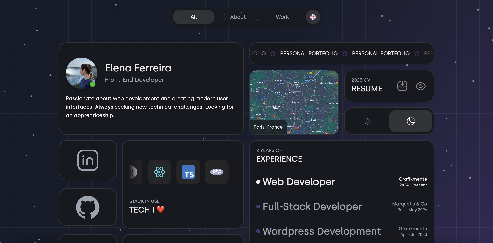

# Elena Ferreira – Portfolio

Bienvenue sur mon portfolio !  
Ce site met en avant mes réalisations en développement front-end, avec une interface moderne, responsive et animée.  
Développé avec **Next.js 15**, **TypeScript** et **Tailwind CSS** ✨

## 🚀 Démarrage rapide

Clone le projet :

```bash
git clone https://github.com/ton-username/ton-repo.git
cd ton-repo
```

Installe les dépendances :

```bash
npm install
# ou
yarn
# ou
pnpm install
# ou
bun install
```

Lance le serveur de développement :

```bash
npm run dev
# ou
yarn dev
# ou
pnpm dev
# ou
bun dev
```

Rends-toi ensuite sur [http://localhost:3000](http://localhost:3000) pour voir le site en local.

## 🌐 Stack technique

- [**Next.js 15**](https://nextjs.org)
- [**TypeScript**](https://www.typescriptlang.org/)
- [**Tailwind CSS**](https://tailwindcss.com)
- [**i18n**](https://next-intl-docs.vercel.app/) – Gestion multilingue

## 🌍 Déploiement

Le site est déployé sur [**Vercel**](https://vercel.com), plateforme officielle pour Next.js.

## 📸 Aperçu



## 🙏 Crédit

Projet créé par Elena FERREIRA
